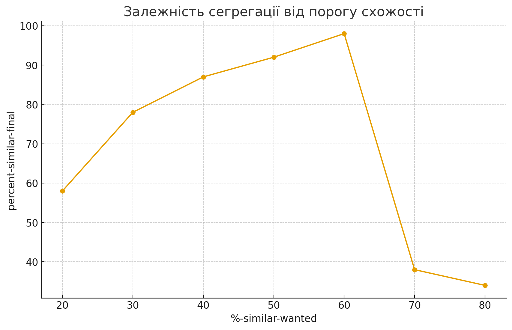
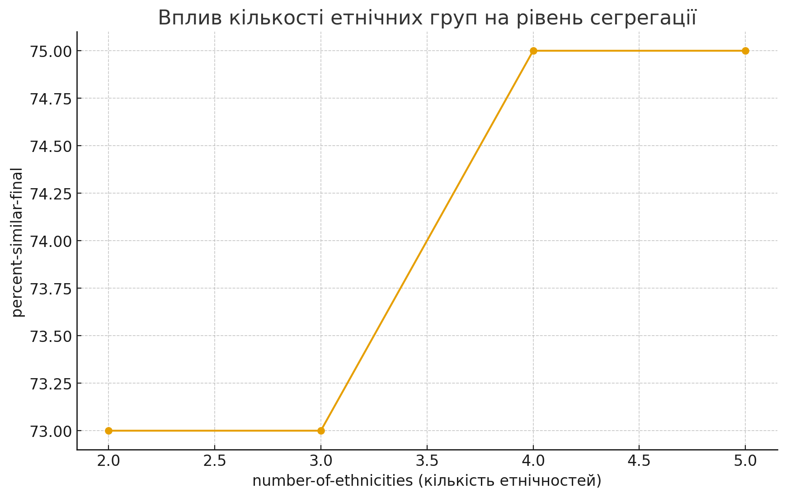
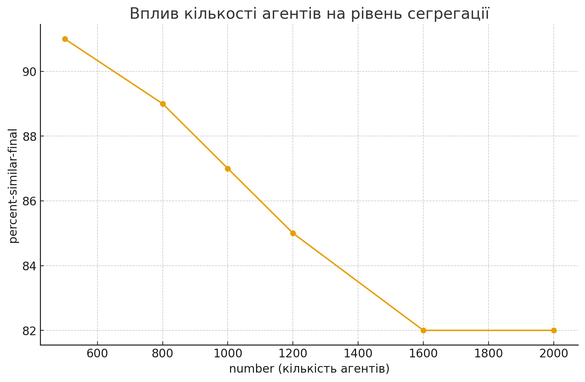

## Комп'ютерні системи імітаційного моделювання
## СПм-24-2, **Замрій Іван Андрійович**
### Лабораторна робота №**1**. Опис імітаційних моделей та проведення обчислювальних експериментів

 

### Варіант 8, модель у середовищі NetLogo:
[Segregation Simple Extension 1](https://www.netlogoweb.org/launch#http://www.netlogoweb.org/assets/modelslib/IABM%20Textbook/chapter%203/Segregation%20Extensions/Segregation%20Simple%20Extension%201.nlogo) 

 

### Вербальний опис моделі
Модель описує процес соціальної сегрегації. Агенти двох і більше груп (позначені кольорами) проживають у клітинковому середовищі та оцінюють своє оточення. Якщо частка сусідів того ж кольору менша за бажаний поріг, агент стає незадоволеним і намагається переїхати. У результаті багаторазових ітерацій у суспільстві з’являються чітко відокремлені райони, хоча індивідуальні агенти не прагнуть до повної сегрегації. Таким чином модель демонструє, як прості локальні правила приводять до глобальної нерівномірності розподілу.

### Керуючі параметри:
- **number** визначає стартову кількість агентів у середовищі моделювання, тобто кількість черепашок, розміщених на випадкових клітинках.
- **number-of-ethnicities** визначає кількість різних груп агентів (етнічностей), що використовуються в моделі. Кожна група має власний колір.
- **%-similar-wanted** визначає мінімальний відсоток сусідів того ж кольору, потрібний агенту для того, щоб бути задоволеним своїм місцем проживання.

### Внутрішні параметри:
- **happy?** показує, чи агент задоволений своїми сусідами.
- **similar-nearby** кількість сусідніх агентів того ж кольору.
- **total-nearby** кількість усіх сусідів.
- **percent-similar** середній відсоток схожих сусідів для всіх агентів у моделі.
- **percent-unhappy** відсоток агентів, які незадоволені.

### Показники роботи системи:
Основні індикатори, які можна оцінювати під час моделювання:

- рівень «схожості» агента з оточенням (**percent-similar**),
- рівень незадоволених (**percent-unhappy**),
- просторове формування груп (кластеризація кольорів),
- динаміка досягнення стабільного стану,
- залежність сегрегації від порогу толерантності (**%-similar-wanted**).

### Недоліки моделі:
- Усі агенти мають однаковий рівень толерантності, тому відсутня індивідуальна різноманітність.
- Переміщення відбуваються випадково, а не шляхом раціонального вибору найкращого місця.

 

## Обчислювальні експерименти

### 1. Вплив порогу толерантності на рівень сегрегації

Мета: перевірити, як зміна значення **%-similar-wanted** впливає на рівень сегрегації та кількість незадоволених агентів у фінальному стані моделі.

**Постійні параметри**
 
- number = 1000  
- number-of-ethnicities = 3  
- час моделювання: до стабілізації або 1000 тік.
- початкове розміщення — випадкове  

Змінний параметр: **%-similar-wanted**

<table>
<thead>
<tr><th>%-similar-wanted</th><th>percent-similar-final</th><th>percent-unhappy-final</th></tr>
</thead>
<tbody>
<tr><td>20%</td><td>58%</td><td>0</td></tr>
<tr><td>30%</td><td>78%</td><td>0</td></tr>
<tr><td>40%</td><td>87%</td><td>0</td></tr>
<tr><td>50%</td><td>92%</td><td>0</td></tr>
<tr><td>60%</td><td>98%</td><td>0</td></tr>
<tr><td>70%</td><td>38%</td><td>81%</td></tr>
<tr><td>80%</td><td>34%</td><td>90%</td></tr>
</tbody>
</table>

 Графік показує, що агенти отримують значно більше «схожих сусідів», ніж вимагають. Навіть якщо агенти мають низькі вимоги до «схожості» сусідів, у результаті система стає сильно сегрегованою.
Коли ж вимоги стають надто високими, суспільство не здатне досягти рівноваги.

 

---

### 2. Вплив кількості етнічних груп на поведінку моделі

Мета: оцінити, чи змінюється характер сегрегації при збільшенні **number-of-ethnicities**.

**Постійні параметри**
 
- number = 2000  
- %-similar-wanted = 30%  
- час моделювання: до стабілізації або максимум 1000 тіків

Змінний параметр: **number-of-ethnicities**

<table>
<thead>
<tr><th>number-of-ethnicities</th><th>percent-similar-final</th><th>percent-unhappy-final</th><th>Опис кластерів</th></tr>
</thead>
<tbody>
<tr><td>2</td><td>73%</td><td>0</td><td>Великі однорідні зони</td></tr>
<tr><td>3</td><td>73%</td><td>0</td><td>Великі однорідні зони</td></tr>
<tr><td>4</td><td>75%</td><td>0</td><td>Багато однокольорових зон</td></tr>
<tr><td>5</td><td>75%</td><td>0</td><td>Багато однокольорових зон</td></tr>
</tbody>
</table>

 При 2–3 етнічностях формуються великі однорідні зони; при 4–5 — картина «плямистіша», але локальна сегрегація все одно висока.

 

---

### 3. Вплив кількості агентів (щільності населення) на досягнення рівноваги

Мета: дослідити, як параметр **number** впливає на час стабілізації та сегрегацію.

**Постійні параметри**
 
- number-of-ethnicities = 3  
- %-similar-wanted = 40%  
- час моделювання: до стабілізації або 1000 ticks  

Змінний параметр: **number**

<table>
<thead>
<tr><th>number</th><th>percent-similar-final</th><th>percent-unhappy-final</th><th>time-to-equilibrium</th></tr>
</thead>
<tbody>
<tr><td>500</td><td>91%</td><td>0</td><td>15</td></tr>
<tr><td>800</td><td>89%</td><td>0</td><td>26</td></tr>
<tr><td>1000</td><td>87%</td><td>0</td><td>19</td></tr>
<tr><td>1200</td><td>85%</td><td>0</td><td>21</td></tr>
<tr><td>1600</td><td>82%</td><td>0</td><td>22</td></tr>
<tr><td>2000</td><td><82%/td><td>0</td><td>27</td></tr>
</tbody>
</table>

 Зі збільшенням щільності населення система все ще здатна досягнути повної задоволеності, але швидкість цього процесу знижується, а ступінь сегрегації — слабшає.
 Проте навіть у дуже густонаселеному середовищі зберігається самопідсилювана сегрегація.

 

---

## Загальний висновок
У моделі спостерігається **самоорганізація сегрегації**:  
навіть за низьких вимог до схожості сусідів суспільство переходить у різко сегрегований стан.