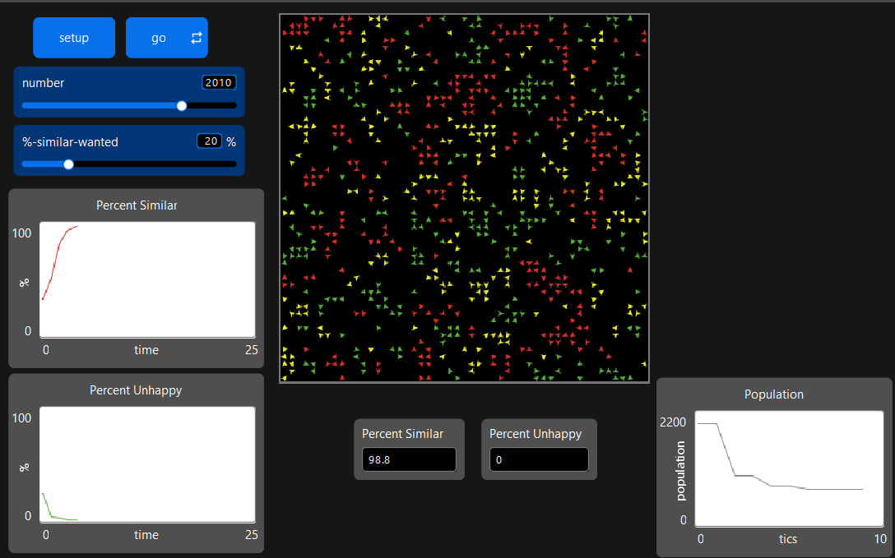
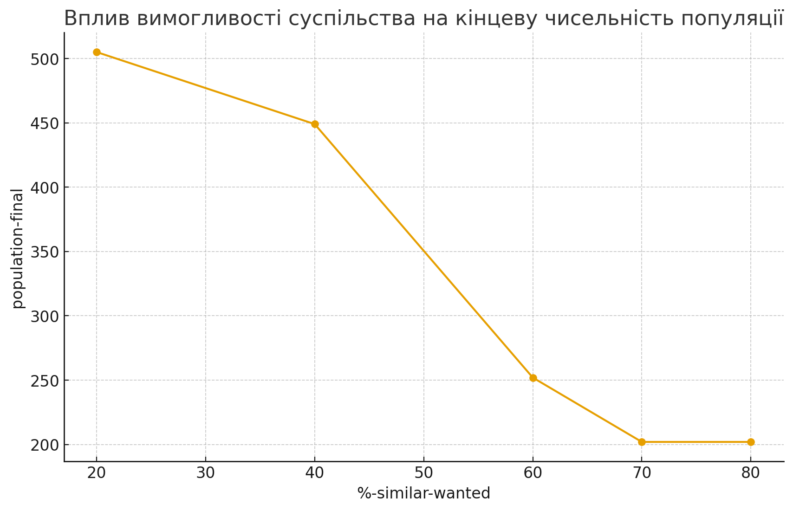
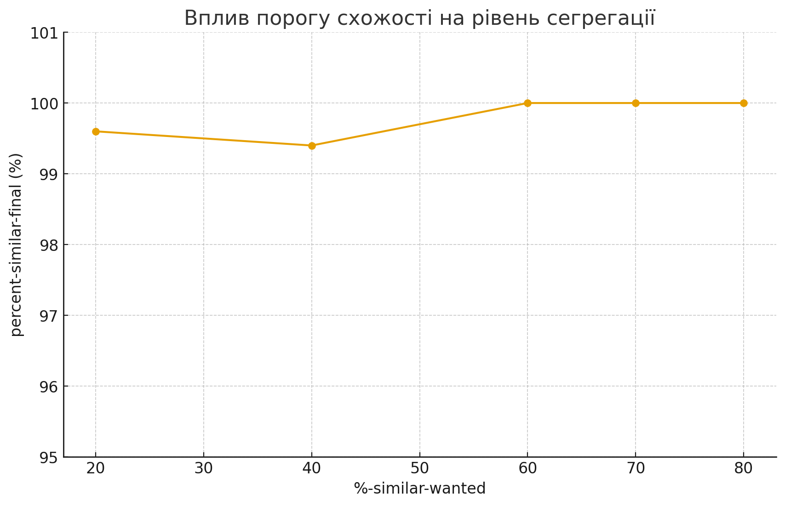

## Комп'ютерні системи імітаційного моделювання
## СПм-24-2, **Замрій Іван Андрійович**
### Лабораторна робота №**2**. Редагування імітаційних моделей у середовищі NetLogo

 

### Варіант 8, модель у середовищі NetLogo:
[Segregation Simple Extension 1](https://www.netlogoweb.org/launch#http://www.netlogoweb.org/assets/modelslib/IABM%20Textbook/chapter%203/Segregation%20Extensions/Segregation%20Simple%20Extension%201.nlogo) 

 
Додати можливість агенту зникнути, вірогідність чого залежить від кількості наявних поряд з ним "чужих" і кількості представників їхньої групи у їх власному оточенні. Виводити графік зміни розміру популяції.

### Внесені зміни у вихідну логіку моделі за варіантом

Додано механізм **зникнення агентів**, ймовірність якого залежить від кількості «чужих» сусідів, та побудову графіка зміни розміру популяції.

---

#### 1. Розширення стану агентів: введено змінну disappear-prob

До списку характеристик кожного агента додано нову змінну:

<pre>
turtles-own [
happy?
similar-nearby
total-nearby
disappear-prob ;; поточна ймовірність зникнення агентів
]
</pre>

Ця змінна зберігає розраховану ймовірність зникнення агента на поточному тіку.

---

#### 2. Оновлення головної процедури `go` — додано етап зникнення агентів

До основного циклу моделі додано процедуру **apply-disappearance**, яка визначає, чи агент залишає систему:

Було:
<pre>
to go
if all? turtles [happy?] [ stop ]
move-unhappy-turtles
update-turtles
update-globals
tick
end
</pre>

Стало:

<pre>
to go
if not any? turtles [ stop ]
if all? turtles [ happy? ] [ stop ]

move-unhappy-turtles
update-turtles
apply-disappearance ;; нова логіка
update-globals
tick
end
</pre>

---

#### 3. Нова поведінка — зникнення агентів

Було додано процедуру, яка розраховує ризик зникнення агентів залежно від кількості сусідів іншого кольору:

<pre>
to apply-disappearance
ask turtles [
let my-neighbors other turtles-on neighbors
let total count my-neighbors

if total > 0 [
  let foreign-neighbors my-neighbors with [ color != [color] of myself ]
  let foreign-count count foreign-neighbors

  if foreign-count > 0 [
    let share-foreign foreign-count / total
    set disappear-prob share-foreign

    if random-float 1 < disappear-prob [
      die
    ]
  ]
]
]
end
</pre>

Чим більше «чужих» навколо агента — тим більше шанс, що він покине систему.  
Якщо агент оточений «своїми» — він майже не зникає.

---

#### 4. Оновлення глобальних показників

<pre>
to update-globals
if any? turtles [
let similar-neighbors sum [similar-nearby] of turtles
let total-neighbors sum [total-nearby] of turtles

if total-neighbors > 0 [
  set percent-similar (similar-neighbors / total-neighbors) * 100
]
set percent-unhappy
  (count turtles with [not happy?]) / (count turtles) * 100
]
end
</pre>

Глобальні показники тепер враховують **лише тих агентів, які ще не зникли**.

---

#### 5. Додано графік зміни популяції

На вкладці Interface додано **Plot** з назвою `Population`, який автоматично відображає:

В pen update commands використовується:

<pre>
plot count turtles
</pre>

Це дозволяє візуально оцінити:

- стабілізувалася популяція чи ні,
- чи виникає різке скорочення чисельності,
- як сегрегація впливає на виживання груп.

---

### Висновок щодо модифікації

Модифікована модель дозволяє аналізувати не лише **сегрегацію**, а й **демографічні наслідки соціального тиску** — тобто, що відбувається з групою, якщо навколишнє середовище переважно «чужорідне».

### Внесені зміни у логіку роботи моделі за власним розсудом

Було змінено логіку визначення задоволеності агентів:  
замість одного глобального порогу схожості `%-similar-wanted` всі агенти отримали **індивідуальний поріг толерантності**, який трохи відрізняється від середнього значення. Це дозволяє моделювати суспільство, в якому одні агенти більш вимогливі до "своїх" сусідів, а інші — більш толерантні до змішаного оточення.

---

#### 1. Розширення стану агентів: введено змінну wanted-similarity

До списку характеристик кожного агента додано нову змінну:

<pre>
turtles-own [
  happy?
  similar-nearby
  total-nearby
  disappear-prob
  wanted-similarity  ;; індивідуальний поріг схожості для кожного агента
]
</pre>

Змінна <code>wanted-similarity</code> зберігає, який відсоток "своїх" сусідів потрібен саме цьому агенту, щоб вважати себе задоволеним.

---

#### 2. Ініціалізація індивідуального порогу толерантності в `setup`

Після створення агентів і призначення їм кольору, кожному агенту задається власний поріг схожості на основі глобального `%-similar-wanted`, але з невеликим відхиленням (розкид ±10%):

<pre>
to setup
  clear-all

  set colors [ red green yellow blue orange ]

  ask n-of number patches [
    sprout 1
  ]

  ask turtles [
    set color (item (random number-of-ethnicities) colors)

    ;; індивідуальний поріг схожості:
    ;; беремо глобальне %-similar-wanted і додаємо випадкове відхилення в діапазоні [-10; 10],
    ;; обрізаємо значення до діапазону [0; 100]
    let delta (random 21 - 10)              ;; випадкове число від -10 до 10
    let candidate (%-similar-wanted + delta)
    set wanted-similarity max list 0 min list 100 candidate
  ]

  update-turtles
  update-globals
  reset-ticks
end
</pre>

Таким чином, глобальний параметр <code>%-similar-wanted</code> задає **середній рівень толерантності**, а конкретні агенти мають трохи більшу або меншу вимогливість.

---

#### 3. Заміна глобального порогу на індивідуальний у правилі щастя

Раніше для перевірки задоволеності агента використовувався один глобальний поріг:

<pre>
set happy? similar-nearby >= ( %-similar-wanted * total-nearby / 100 )
</pre>

Тепер кожен агент використовує **свій індивідуальний** поріг <code>wanted-similarity</code>:

<pre>
to update-turtles
  ask turtles [
    set similar-nearby count (turtles-on neighbors)
      with [color = [color] of myself]

    set total-nearby count (turtles-on neighbors)

    ifelse total-nearby > 0 [
      ;; використовуємо індивідуальний поріг wanted-similarity
      set happy? similar-nearby >= ( wanted-similarity * total-nearby / 100 )
    ][
      set happy? true
    ]
  ]
end
</pre>

Отже, два агенти однакового кольору можуть по-різному оцінювати однакове оточення:  
один — вважати його комфортним, інший — ні.

---

#### 4. Інтерпретація змін

- Модель перестає бути «однорідним суспільством», де всі мають одну й ту ж толерантність.
- З’являється **реалістичне різноманіття індивідуальних установок**:
  - частина агентів більш терпимі, готові жити в змішаних районах;
  - частина — більш вимогливі, відчувають дискомфорт навіть при невеликій домішці "чужих".
- Загальна логіка моделі **не порушується**:
  - агенти, як і раніше, оцінюють своє оточення;
  - незадоволені агенти переїжджають;
  - працює варіантна логіка зникнення та графік популяції;
  - але просторові патерни сегрегації стають багатшими та менш симетричними.

---

#### 5. Висновок щодо змін
Запропоновані зміни роблять модель ближчою до реальних соціальних систем, де люди мають **різні рівні толерантності** до різноманіття. Модель як і раніше зберігає основну ідею (локальні правила → глобальна сегрегація), але дозволяє дослідити:

- як розкид індивідуальних порогів впливає на швидкість сегрегації,
- чи можуть більш толерантні агенти «пом’якшити» загальний рівень поділу суспільства,
- як співіснують дуже вимогливі та більш гнучкі агенти в одному середовищі.

### Вплив порогу толерантності на виживання популяції (з урахуванням індивідуальних порогів та зникнення агентів)

Мета: дослідити, як глобальний параметр %-similar-wanted (середній бажаний відсоток «своїх» сусідів), при наявності:
індивідуальних порогів wanted-similarity у агентів
механізму зникнення (disappear-prob),
впливає на: ступінь сегрегації, кінцеву чисельність популяції.

Постійні параметри
 

number = 1000

number-of-ethnicities = 3

час моделювання: 300 ticks

логіка моделі:
– для кожного агента задається індивідуальний поріг wanted-similarity ≈ %-similar-wanted ± 10
– ймовірність зникнення агента зростає із часткою «чужих» сусідів (disappear-prob)

Змінний параметр: %-similar-wanted

<table> <thead> 
<tr> <th>%-similar-wanted</th> <th>percent-similar-final</th> <th>percent-unhappy-final</th> <th>population-final</th> </tr> </thead> 
<tbody> 
<tr><td>20%</td><td>99.6%</td><td>0</td><td>505</td></tr> 
<tr><td>30%</td><td>99.5%</td><td>0</td><td>505</td></tr> 
<tr><td>40%</td><td>99.4%</td><td>0</td><td>449</td></tr> 
<tr><td>60%</td><td>100%</td><td>0</td><td>252</td></tr> 
<tr><td>70%</td><td></td><td></td><td></td></tr> 
<tr><td>80%</td><td>100%</td><td>0</td><td>202</td></tr> </tbody> </table>

Графік 1:
%-similar-wanted → population-final
(як змінюється кінцева чисельність популяції залежно від вимогливості суспільства)

Графік 2:
%-similar-wanted → percent-similar-final
(як змінюється сегрегація на фоні зникнення агентів та індивідуальних порогів)

Приклад підписів:

 

При низькому %-similar-wanted (20%)
• агенти легко адаптуються
• зникнення майже відсутнє
• популяція зберігається майже повністю
• сегрегація висока, але без демографічних втрат

 

При помірних значеннях (40–60%)
• частина агентів відчуває сильний тиск «чужих»
• population-final починає помітно падати
• рівень сегрегації вже майже 100%
• суспільство зберігає сегрегацію ціною втрат

 

При високих значеннях (70–80%)
• багато агентів не можуть знайти «своє» місце
• масово спрацьовує механізм disappear-prob
• популяція скорочується більше ніж на 50%
• ті, хто вижив — формують повністю однорідні райони

  

Узагальнений висновок

Зі зростанням вимогливості суспільства система переходить
від стабільної сегрегації зі збереженням популяції
до ситуації, коли значна частина агентів зникає.
Сегрегація все одно виникає, але ціною демографічних втрат.