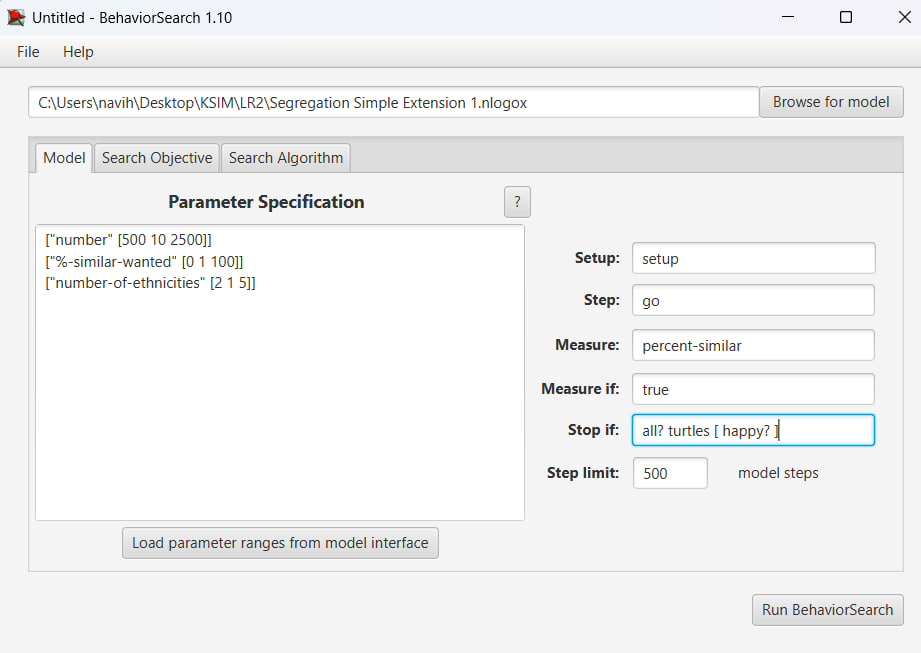
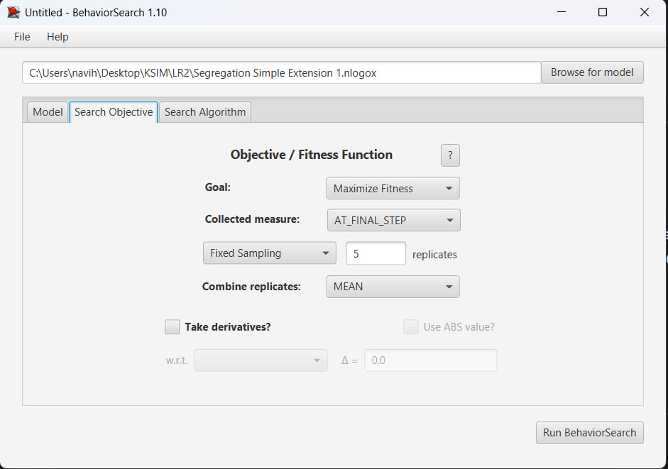
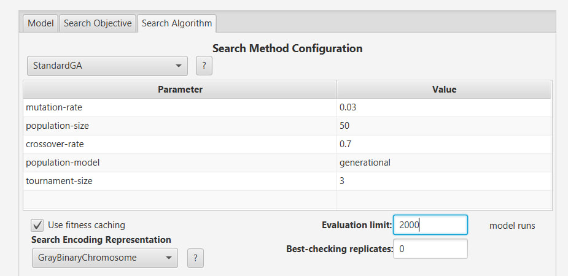
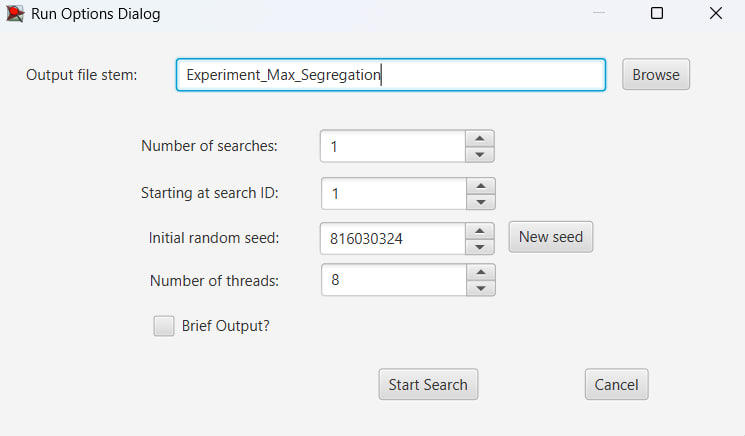
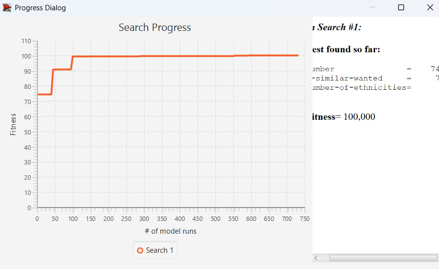
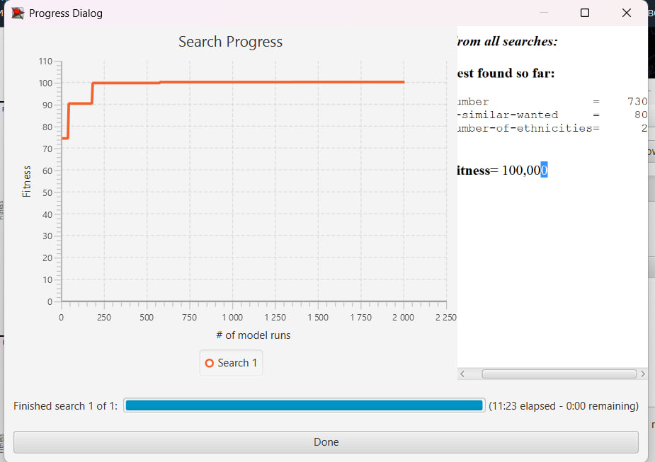
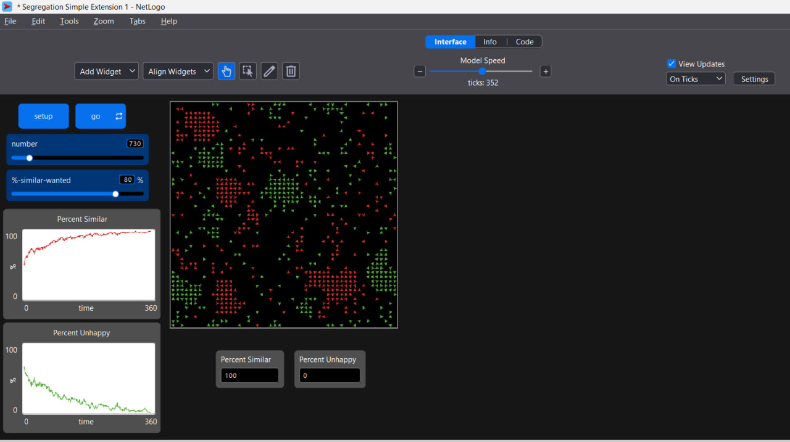

## Комп'ютерні системи імітаційного моделювання
## СПм-24-2, **Замрій Іван Андрійович**
### Лабораторна робота №**3**. Використання засобів обчислювального интелекту для оптимізації імітаційних моделей

 

### Варіант 8, модель у середовищі NetLogo:
[Segregation Simple Extension 1](https://www.netlogoweb.org/launch#http://www.netlogoweb.org/assets/modelslib/IABM%20Textbook/chapter%203/Segregation%20Extensions/Segregation%20Simple%20Extension%201.nlogo) 

### Вербальний опис моделі
Модель описує процес соціальної сегрегації. Агенти двох і більше груп (позначені кольорами) проживають у клітинковому середовищі та оцінюють своє оточення. Якщо частка сусідів того ж кольору менша за бажаний поріг, агент стає незадоволеним і намагається переїхати. У результаті багаторазових ітерацій у суспільстві з’являються чітко відокремлені райони, хоча індивідуальні агенти не прагнуть до повної сегрегації. Таким чином модель демонструє, як прості локальні правила приводять до глобальної нерівномірності розподілу.

### Керуючі параметри:
- **number** визначає стартову кількість агентів у середовищі моделювання, тобто кількість черепашок, розміщених на випадкових клітинках.
- **number-of-ethnicities** визначає кількість різних груп агентів (етнічностей), що використовуються в моделі. Кожна група має власний колір.
- **%-similar-wanted** визначає мінімальний відсоток сусідів того ж кольору, потрібний агенту для того, щоб бути задоволеним своїм місцем проживання.

### Показники роботи системи:
Основні індикатори, які можна оцінювати під час моделювання:

- рівень «схожості» агента з оточенням (**percent-similar**),
- рівень незадоволених (**percent-unhappy**),
- просторове формування груп (кластеризація кольорів),
- динаміка досягнення стабільного стану,
- залежність сегрегації від порогу толерантності (**%-similar-wanted**).

## Налаштування середовища BehaviorSearch:

**Обрана модель**:
<pre>
D:\NetLogo\models\IABM Textbook\chapter 3\Segregation Extensions\Segregation Simple Extension 1.nlogox
</pre>

**Параметри моделі** (вкладка Model):  

Завантажуємо діапазони параметрів із інтерфейсу моделі та встановлюємо діапазон для кожного значення.

<pre>
["number" [500 10 2500]]
["%-similar-wanted" [0 1 100]]
["number-of-ethnicities" [2 1 5]]
</pre>

Використовувана **міра**:  
Для фітнес-функції було обрано percent-similar (відсоток схожих), вираз для її розрахунку взято з налаштувань графіка аналізованої імітаційної моделі в середовищі NetLogo  
  
та вказано у параметрі "**Measure**":

<pre>
percent-similar
</pre>

Ставимо умову зупинки, щоб модель зупинялася, як тільки всі заспокояться all? turtles [ happy? ] (коли всі агенти щасливі)

**Налаштування цільової функції** (вкладка Search Objective):  

Так як ми хочемо максимізувати показник percent-similar - знайти параметри, при яких сегрегація найвища, залишаємо:

<pre>
Goal: Maximize Fitness
</pre>

Далі нам потрібно виміряти percent-similar, коли симуляція завершилася (або через Stop if, або по step limit). Тому обираємо: 

<pre>
Collected Measure: AT_FINAL_STEP
</pre>
Далі ставимо кількість повторних запусків моделі для одного набору параметрів. Ставимо 5, щоб сильно не навантажувати систему.

  

**Загальний вигляд вкладки налаштувань цільової функції:**

Оскільки використовуємо саме Генетичний Алгоритм (StandardGA)
Потрібно збільшити "бюджет" часу.

Змінемо Evaluation limit з 300 на 2000. Це займе більше часу, але алгоритм встигне "еволюціонувати" до хорошого результату.

 

### Результати використання BehaviorSearch:
Діалогове вікно запуску пошуку:  

Результат пошуку параметрів імітаційної моделі, використовуючи **генетичний алгоритм**:  

Результат пошуку параметрів імітаційної моделі, використовуючи **випадковий пошук**:  

Тестування отриманих параметрів на моделі:
Обидва алгоритми прийшли до майже однакових "ідеальних" налаштувань:
Населення: Середнє (~730-740 агентів). Не замало (щоб заповнити простір), але й не максимум (щоб було де рухатись).
Вимогливість (%-similar): Висока (70-80%). Це змушує агентів не зупинятися, поки вони повністю не відокремляться.
Етноси: 2. Мінімум можливого.
Обидва алгоритми впорались на 100%. Ключовий фактор: В обох випадках алгоритми одразу зрозуміли (або вгадали), що треба зменшити кількість етносів до 2. Це головний секрет успіху в цій моделі. 

